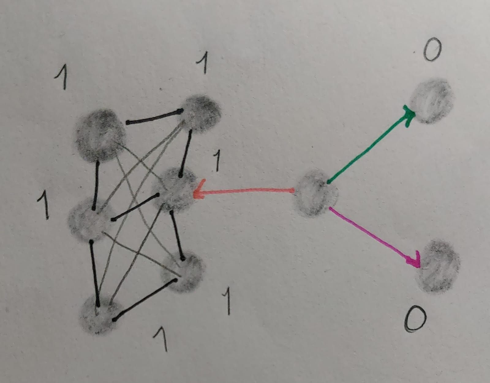

```{r message=FALSE, warning=FALSE}
library(igraph)
```

### PREGUNTAS.

**1. Considera una red de 15 nodos . Considera que tienes una sola conexión. ¿Cuál es el número máximo de nodos que puedes conectar? Dado un solo nodo , ¿cuál es el número máximo conexiones que puede tener tal nodo?**

Una sola conexion conecta a 2 nodos, se tiene un total de 14 conexiones para los 15 nodos si tomamos solo una conexion (salida–entrada a otro nodo). Asi que cada nodo solo puede tener 2 conexiones; la del nodo que lo conecta (in) y su conexion a otro nodo (out)

**2. Considera una red dirigida de 10 nodos. Usa 25 conexiones y dibuja una red con ese número de nodos y conexiones dirigidas. Calcula la distribución de conectividades de salida. Calcula el número total de conexiones de salida ¿Cómo se compara el número total de de conectividades de entrada (son iguales, diferentes)? Explica tu respuesta. Calcula el promedio de entrada y de salida. Discute tu resultado.**

Son los mismos valores, esto porque por cada nodo que entra hay un nodo de salida, no significa que esten conectados entre si, pero cada nodo tiene una entrada y una salida minimo. Por lo tanto el promedio debe de ser el mismo. De igual manera a pesar de que lhay nodos con varias entradas y salidad todos al menos tiene una.

```{r}
g <- make_empty_graph(n = 10, directed = TRUE)


conexiones <- c(1,2, 1,3, 2,4, 2,5, 3,6,
  3,7, 4,1, 4,8, 5,9, 5,10,
  6,2, 6,5, 7,3, 7,6, 8,10,
  8,7, 9,4, 9,8, 10,1, 10,9,
  1,4, 2,6, 3,9, 6,10, 7,1)

# Agregar las aristas al grafo
g <- add_edges(g, conexiones)

plot(g)

degree(g, mode = "out")->salida
sum(salida)
barplot(salida, col = "orange", main ="SALIDA")

degree(g, mode = "in")->entrada
sum(entrada)#---tambien son 25
barplot(entrada, col = "purple", main ="ENTRADA")
degree(g, mode = "in")

mean(salida)
mean(entrada)

 g5 <-make_full_graph(6, directed = TRUE)

 plot(g5)
degree(g5)
```

**3. Considera una red no dirigida de \\(n=3,4,5,6\\) nodos respectivamente. ¿Cuál es el número máximo de conexiones que puedes poner? Dibuja cada caso. ¿Qué pasa si la red es dirigida?**

RED 3: 3

RED4: 6

RED5: 10

RED6: 13

Se tendria el doble de conexiones para que el nodo A conecte al nodo B para ser igual a la no dirigida.

{width="428"} **4. Considera tu red de amigos reales.¿ Cuál es tu coeficiente de clusterización?**
De 1 para una parte de la red y de 0 para las otras partes.

{width="382"}

**CALCULO A MANO DE LAS REDES:**

en esta el diametro igual a 5

{width="358"}

{width="351"}

{width="359"}

{width="369"}

{width="361"}

{width="420"}
